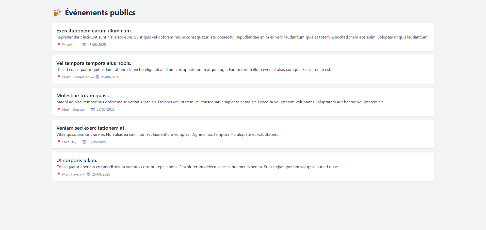

# Event-Ease

Event-Ease est une application de gestion d'événements permettant aux utilisateurs de créer, organiser et participer à des événements facilement.

## Fonctionnalités

- Création et gestion d'événements
- Inscription et participation aux événements
- Gestion des participants
- Notifications et rappels
- Interface utilisateur intuitive

## Installation

1. Clonez le dépôt :
    ```bash
    git clone https://github.com/votre-utilisateur/event-ease.git
    cd event-ease
    ```
2. Installez les dépendances :
    ```bash
    npm install
    ```
3. Lancez l'application :
    ```bash
    npm start
    ```

## Prérequis

- Node.js >= 14.x
- npm >= 6.x

## Utilisation

1. Accédez à l'application via `http://localhost:3000`
2. Créez un compte ou connectez-vous
3. Commencez à créer ou rejoindre des événements

## Structure du projet

```
/event-ease
├── src/
│   ├── components/
│   ├── pages/
│   ├── services/
│   └── App.js
├── public/
├── package.json
└── README.md
```

## 📸 Aperçu de l’application



## Licence

Ce projet est sous licence MIT.


